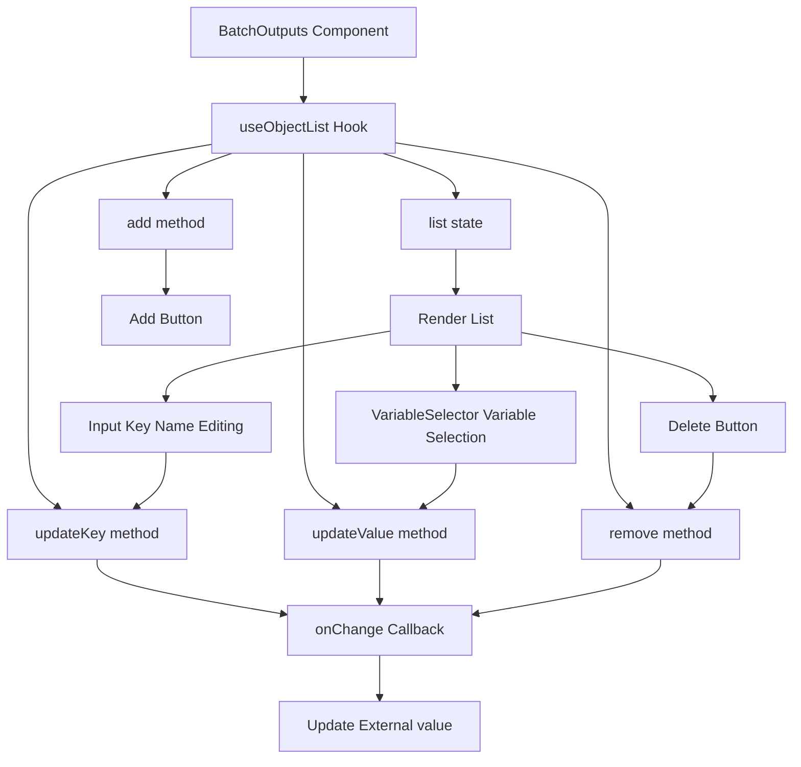
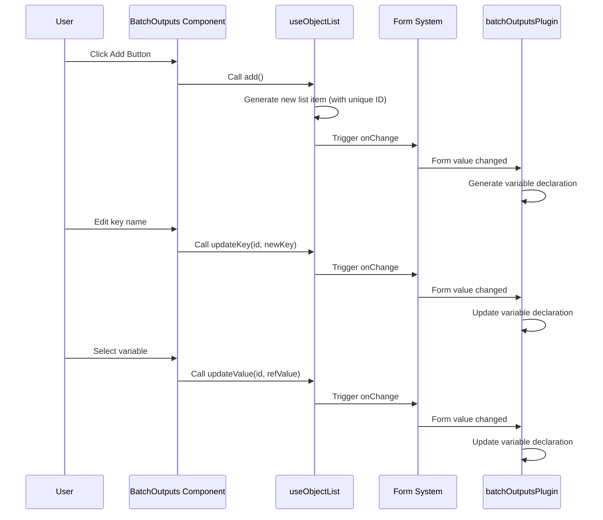

import { SourceCode } from '@theme';
import { BasicStory } from 'components/form-materials/components/batch-outputs';

# BatchOutputs

`BatchOutputs` is a key-value pair editor component for configuring loop outputs. In loop node scenarios, it allows users to define output values to be collected in each iteration, which will eventually be aggregated into arrays.

**Core Features:**

- ➕ **Dynamic Add/Remove**: Users can freely add or remove output key-value pairs
- ✏️ **Key Name Editing**: Define a unique key name for each output
- 🔗 **Variable Reference**: Reference variables available within the loop body through a variable selector
- 👁️ **Readonly Mode**: Supports readonly display for viewing scenarios

:::warning

`BatchOutputs` must be used with [batchOutputsPlugin](../form-plugins/batch-outputs-plugin) to work properly. This is because:
1. The component handles UI interaction, collecting output key-value pairs configured by the user
2. The plugin is responsible for converting configurations into variable declarations and adjusting the scope chain

:::

:::info{title="Complete Solution Overview"}

Implementing a complete loop node requires the following three materials working together:

| Material | Type | Responsibility |
|------|------|------|
| [BatchVariableSelector](./batch-variable-selector) | Component | Select the array data source for the loop |
| [provideBatchInputEffect](../effects/provide-batch-input) | Effect | Generate `item` and `index` local variables |
| **BatchOutputs** + [batchOutputsPlugin](../form-plugins/batch-outputs-plugin) | Component + Plugin | Configure loop outputs and generate array-type variables |

:::

## Demo

### Basic Usage

<BasicStory />

```tsx pure title="form-meta.tsx"
import { FormRenderProps, FlowNodeJSON, Field, FormMeta } from '@flowgram.ai/free-layout-editor';
import {
  BatchOutputs,
  BatchVariableSelector,
  createBatchOutputsFormPlugin,
  IFlowRefValue,
  provideBatchInputEffect,
} from '@flowgram.ai/form-materials';

interface LoopNodeJSON extends FlowNodeJSON {
  data: {
    loopFor: IFlowRefValue;
  };
}

export const LoopFormRender = ({ form }: FormRenderProps<LoopNodeJSON>) => {
  return (
    <>
      <FormHeader />
      <FormContent>
        <Field<IFlowRefValue> name="loopFor">
          {({ field, fieldState }) => (
            <FormItem name="loopFor" type="array" required>
              <BatchVariableSelector
                style={{ width: '100%' }}
                value={field.value?.content}
                onChange={(val) => field.onChange({ type: 'ref', content: val })}
                hasError={Object.keys(fieldState?.errors || {}).length > 0}
              />
            </FormItem>
          )}
        </Field>
        <Field<Record<string, IFlowRefValue | undefined> | undefined> name="loopOutputs">
          {({ field, fieldState }) => (
            <FormItem name="loopOutputs" type="object" vertical>
              <BatchOutputs
                style={{ width: '100%' }}
                value={field.value}
                onChange={(val) => field.onChange(val)}
                hasError={Object.keys(fieldState?.errors || {}).length > 0}
              />
            </FormItem>
          )}
        </Field>
      </FormContent>
    </>
  );
};

export const formMeta: FormMeta = {
  render: LoopFormRender,
  effect: {
    loopFor: provideBatchInputEffect,
  },
  plugins: [createBatchOutputsFormPlugin({ outputKey: 'loopOutputs', inferTargetKey: 'outputs' })],
};
```

:::info{title="About FormHeader, FormContent, FormItem"}

The `FormHeader`, `FormContent`, and `FormItem` in the code above are user-defined layout components for unified form styling. You can implement them according to your project needs or replace them with other UI components.

:::

### Readonly Mode

By setting the `readonly` property, you can disable editing functionality, suitable for viewing or preview scenarios:

```tsx pure
<BatchOutputs
  readonly
  value={{
    names: { type: 'ref', content: ['item', 'name'] },
    ages: { type: 'ref', content: ['item', 'age'] },
  }}
/>
```

## API Reference

### BatchOutputs Props

| Property | Type | Default | Description |
|--------|------|--------|------|
| `value` | `Record<string, IFlowRefValue \| undefined>` | - | Output key-value object, key is the output name, value is the variable reference |
| `onChange` | `(value?: Record<string, IFlowRefValue \| undefined>) => void` | - | Callback function when value changes |
| `readonly` | `boolean` | `false` | Whether in readonly mode |
| `hasError` | `boolean` | `false` | Whether to show error state |
| `style` | `React.CSSProperties` | - | Custom styles |

### Value Type Description

```typescript
type ValueType = Record<string, IFlowRefValue | undefined>;

interface IFlowRefValue {
  type: 'ref';
  content?: string[];
}
```

#### Value Structure Example

```typescript
{
  names: { type: 'ref', content: ['loop_1_locals', 'item', 'name'] },
  ages: { type: 'ref', content: ['loop_1_locals', 'item', 'age'] },
  scores: { type: 'ref', content: ['loop_1_locals', 'item', 'score'] },
}
```

## Source Code Guide

<SourceCode
  href="https://github.com/bytedance/flowgram.ai/tree/main/packages/materials/form-materials/src/components/batch-outputs"
/>

Use the CLI command to copy the source code locally:

```bash
npx @flowgram.ai/cli@latest materials components/batch-outputs
```

### Directory Structure

```
batch-outputs/
├── index.tsx          # Main component implementation
├── types.ts           # Type definitions
└── styles.css         # Style file
```

### Core Implementation

#### Component Structure

The BatchOutputs component is based on the `useObjectList` hook for dynamic list management, each row contains:
- **Input**: For editing output key names
- **InjectVariableSelector**: For selecting variable references
- **Delete Button**: Delete the current row

#### Data Flow



#### useObjectList Hook

`useObjectList` is a general-purpose dynamic object list management hook with core features:

1. **List State Management**: Maintains list items with unique IDs
2. **Bidirectional Sync**: Synchronizes and updates the list when the `value` property changes
3. **CRUD Operations**: Provides `add`, `remove`, `updateKey`, `updateValue` methods

```typescript
interface UseObjectListOptions<T> {
  value?: Record<string, T | undefined>;
  onChange?: (value?: Record<string, T | undefined>) => void;
}

interface UseObjectListReturn<T> {
  list: Array<{ id: string; key: string; value: T | undefined }>;
  add: () => void;
  remove: (id: string) => void;
  updateKey: (id: string, newKey: string) => void;
  updateValue: (id: string, newValue: T) => void;
}

const { list, add, updateKey, updateValue, remove } = useObjectList({
  value,
  onChange,
});
```

#### Complete Data Flow Sequence Diagram



### Dependencies

#### flowgram API

[**@flowgram.ai/editor**](https://github.com/bytedance/flowgram.ai/tree/main/packages/client/editor)
- [`I18n`](https://flowgram.ai/auto-docs/editor/modules/I18n): Internationalization tool for button text

#### Dependent Materials

[**useObjectList**](https://github.com/bytedance/flowgram.ai/tree/main/packages/materials/form-materials/src/hooks/use-object-list)
- Dynamic object list management hook, handles list CRUD operations

[**InjectVariableSelector**](./variable-selector)
- Injection-based variable selector for selecting variable references

#### Third-party Dependencies

- `@douyinfe/semi-ui`: UI component library, uses Button, Input components
- `@douyinfe/semi-icons`: Icon library, uses IconDelete, IconPlus icons

## FAQ

### Why do I need to use both BatchOutputs component and batchOutputsPlugin?

This is a separation of concerns design:

| Role | Responsibility |
|------|------|
| `BatchOutputs` Component | Provides UI interaction, lets users configure output key names and variable references |
| `batchOutputsPlugin` | Handles data logic, converts configurations to variable declarations and adjusts scope chain |

Using the component alone only collects data and cannot generate valid output variables; using the plugin alone has no UI to configure data.

### What's the difference between BatchOutputs and InputsValues?

| Feature | BatchOutputs | InputsValues |
|------|--------------|--------------|
| Purpose | Loop output configuration | Node input configuration |
| Value Type | `Record<string, IFlowRefValue>` | `IInputsValues` |
| Variable Reference | Only supports variable references | Supports constants and variable references |
| Use Case | Output aggregation for Loop nodes | Input parameters for general nodes |

### How to customize the variable selector filter conditions?

Currently, `BatchOutputs` internally uses `InjectVariableSelector` and does not support custom filter conditions. If customization is needed, you can refer to the source code to implement your own component:

```tsx
import { useObjectList } from '@flowgram.ai/form-materials';
import { VariableSelector } from '@flowgram.ai/form-materials';

function CustomBatchOutputs(props) {
  const { list, add, updateKey, updateValue, remove } = useObjectList(props);
  
  return (
    <div>
      {list.map((item) => (
        <div key={item.id}>
          <Input value={item.key} onChange={(v) => updateKey(item.id, v)} />
          <VariableSelector
            value={item.value?.content}
            onChange={(v) => updateValue(item.id, { type: 'ref', content: v })}
            includeSchema={{ type: 'string' }}
          />
          <Button onClick={() => remove(item.id)}>Delete</Button>
        </div>
      ))}
      <Button onClick={() => add()}>Add</Button>
    </div>
  );
}
```

### How to get the generated output variable types?

When used with `batchOutputsPlugin` and if `inferTargetKey` is configured, the JSON Schema of the output variables will be automatically written to the specified field when the form is submitted:

```typescript
plugins: [
  createBatchOutputsFormPlugin({ 
    outputKey: 'loopOutputs', 
    inferTargetKey: 'outputs'
  })
]
```

Example of form data structure after submission:

```typescript
{
  loopOutputs: {
    names: { type: 'ref', content: ['item', 'name'] },
    ages: { type: 'ref', content: ['item', 'age'] },
  },
  outputs: {
    type: 'object',
    properties: {
      names: { type: 'array', items: { type: 'string' } },
      ages: { type: 'array', items: { type: 'number' } },
    }
  }
}
```

### How to handle duplicate key names?

Currently, the component does not automatically detect duplicate key names. It is recommended to add validation logic at the form level:

```typescript
const formMeta: FormMeta = {
  validate: {
    loopOutputs: (value) => {
      if (!value) return;
      const keys = Object.keys(value);
      const uniqueKeys = new Set(keys);
      if (keys.length !== uniqueKeys.size) {
        return 'Output key names cannot be duplicated';
      }
    },
  },
};
```

## Related Materials

- [BatchVariableSelector](./batch-variable-selector): Array variable selector for selecting loop input
- [provideBatchInputEffect](../effects/provide-batch-input): Loop input variable parsing effect
- [batchOutputsPlugin](../form-plugins/batch-outputs-plugin): Loop output plugin, handles scope chain and type inference
