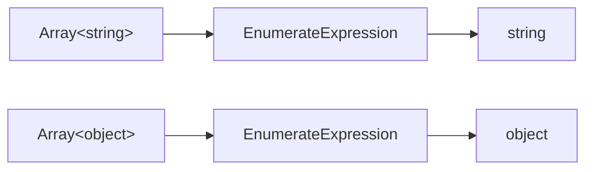
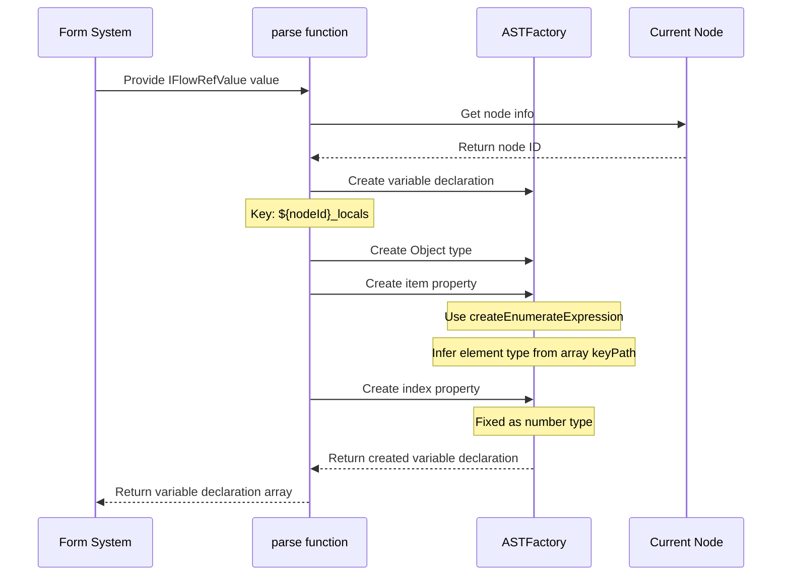
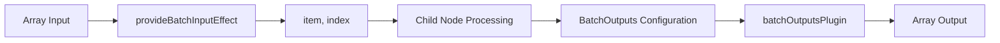

import { SourceCode } from '@theme';
import { BasicStory } from 'components/form-materials/effects/provide-batch-input';

# provideBatchInputEffect

`provideBatchInputEffect` is a form effect specifically designed for loop node scenarios. It parses the loop input array variable into two local variables:

- **item**: The current iteration's array element, with type automatically inferred from the input array's element type
- **index**: The current iteration's index, with type `number`

**Core Features:**

- 🔄 **Automatic Type Inference**: Automatically infers the `item` element type from the array type
- 🔒 **Private Scope**: Generated variables are stored in the node's private scope, accessible only to the current node and its child nodes
- 🎯 **Loop-specific**: Designed specifically for batch processing/loop scenarios

This allows child nodes within the loop body to reference the `item` and `index` variables for processing array elements individually.

:::info{title="Complete Solution Overview"}

Implementing a complete loop node requires the following three materials working together:

| Material | Type | Responsibility |
|------|------|------|
| [BatchVariableSelector](../components/batch-variable-selector) | Component | Select the array data source for the loop |
| **provideBatchInputEffect** | Effect | Generate `item` and `index` local variables |
| [BatchOutputs](../components/batch-outputs) + [batchOutputsPlugin](../form-plugins/batch-outputs-plugin) | Component + Plugin | Configure loop outputs and generate array-type variables |

:::

## Demo

### Basic Usage

:::tip

After selecting an array-type variable, `provideBatchInputEffect` will automatically generate `item` and `index` local variables, which can be seen in the variable selector below.

:::

<BasicStory />

```tsx pure title="form-meta.tsx"
import { FormRenderProps, FlowNodeJSON, Field, FormMeta } from '@flowgram.ai/free-layout-editor';
import {
  BatchOutputs,
  BatchVariableSelector,
  createBatchOutputsFormPlugin,
  IFlowRefValue,
  provideBatchInputEffect,
} from '@flowgram.ai/form-materials';

interface LoopNodeJSON extends FlowNodeJSON {
  data: {
    loopFor: IFlowRefValue;
  };
}

export const LoopFormRender = ({ form }: FormRenderProps<LoopNodeJSON>) => {
  return (
    <>
      <FormHeader />
      <FormContent>
        <Field<IFlowRefValue> name="loopFor">
          {({ field, fieldState }) => (
            <FormItem name="loopFor" type="array" required>
              <BatchVariableSelector
                style={{ width: '100%' }}
                value={field.value?.content}
                onChange={(val) => field.onChange({ type: 'ref', content: val })}
                hasError={Object.keys(fieldState?.errors || {}).length > 0}
              />
            </FormItem>
          )}
        </Field>
        <Field<Record<string, IFlowRefValue | undefined> | undefined> name="loopOutputs">
          {({ field, fieldState }) => (
            <FormItem name="loopOutputs" type="object" vertical>
              <BatchOutputs
                style={{ width: '100%' }}
                value={field.value}
                onChange={(val) => field.onChange(val)}
                hasError={Object.keys(fieldState?.errors || {}).length > 0}
              />
            </FormItem>
          )}
        </Field>
      </FormContent>
    </>
  );
};

export const formMeta: FormMeta = {
  render: LoopFormRender,
  effect: {
    loopFor: provideBatchInputEffect,
  },
  plugins: [createBatchOutputsFormPlugin({ outputKey: 'loopOutputs', inferTargetKey: 'outputs' })],
};
```

:::info{title="About FormHeader, FormContent, FormItem"}

The `FormHeader`, `FormContent`, and `FormItem` in the code above are user-defined layout components for unified form styling. You can implement them according to your project needs or replace them with other UI components.

:::

## API Reference

### provideBatchInputEffect

Provides a form effect that parses the loop input array variable into `item` and `index` local variables.

```typescript
import { provideBatchInputEffect } from '@flowgram.ai/form-materials';

const formMeta: FormMeta = {
  effect: {
    loopFor: provideBatchInputEffect,
  },
};
```

#### Parameters

This effect is created internally using `createEffectFromVariableProvider` with the following configuration:

| Property | Value | Description |
|------|------|------|
| `private` | `true` | Generated variables are stored in the node's private scope |

:::tip{title="About the private parameter"}

Setting `private: true` stores variables in `node.privateScope` instead of `node.scope`. This means:
- Variables are only visible within the current node and its child nodes
- They cannot be accessed by downstream nodes of the parent node
- Suitable for temporary iteration variables in loop scenarios

See: [Node Private Scope](../../guide/variable/concept#node-private-scope)

:::

#### Return Value

- `EffectOptions[]`: Array of form effect options for `formMeta.effect` configuration

#### Generated Variable Structure

The effect creates a variable `${nodeId}_locals` in the current node's **private scope** with the following structure:

| Field | Type | Description |
|------|------|------|
| `item` | Inferred from array element type | The current iteration's array element |
| `index` | `number` | The current iteration's index |

#### Generated AST Structure Example

Assuming the loop input variable path is `['start_0', 'list']`, the generated AST structure is:

```typescript
{
  kind: 'VariableDeclaration',
  key: 'loop_1_locals',
  meta: {
    title: 'Loop Node',
    icon: 'loop-icon'
  },
  type: {
    kind: 'ObjectType',
    properties: [
      {
        kind: 'Property',
        key: 'item',
        initializer: {
          kind: 'EnumerateExpression',
          enumerateFor: {
            kind: 'KeyPathExpression',
            keyPath: ['start_0', 'list']
          }
        }
      },
      {
        kind: 'Property',
        key: 'index',
        type: { kind: 'NumberType' }
      }
    ]
  }
}
```

## Source Code Guide

<SourceCode
  href="https://github.com/bytedance/flowgram.ai/tree/main/packages/materials/form-materials/src/effects/provide-batch-input/index.ts"
/>

Use the CLI command to copy the source code locally:

```bash
npx @flowgram.ai/cli@latest materials effects/provide-batch-input
```

### Directory Structure

```
provide-batch-input/
└── index.ts           # Main implementation file, exports provideBatchInputEffect form effect
```

### Core Implementation

#### Variable Generation Logic

`provideBatchInputEffect` uses the [`createEffectFromVariableProvider`](../../guide/variable/variable-output) factory function to create a variable provider. Key characteristics:

1. **Private Variables**: Setting `private: true` makes generated variables visible only within the current node's scope
2. **Element Type Inference**: Uses `ASTFactory.createEnumerateExpression` to infer element type from the array type
3. **Index Variable**: Fixed as `number` type

#### Type Inference Principle

`EnumerateExpression` is an expression type provided by the variable engine for inferring element type from array type:



When the upstream variable type changes, the `item` type will **automatically update accordingly**.

#### Variable Generation Flow Sequence Diagram



#### Key Code Analysis

```typescript
export const provideBatchInputEffect: EffectOptions[] = createEffectFromVariableProvider({
  private: true,
  parse: (value: IFlowRefValue, ctx) => [
    ASTFactory.createVariableDeclaration({
      key: `${ctx.node.id}_locals`,
      meta: {
        title: ctx.node.form?.getValueIn('title'),
        icon: ctx.node.getNodeRegistry<FlowNodeRegistry>().info?.icon,
      },
      type: ASTFactory.createObject({
        properties: [
          ASTFactory.createProperty({
            key: 'item',
            initializer: ASTFactory.createEnumerateExpression({
              enumerateFor: ASTFactory.createKeyPathExpression({
                keyPath: value.content || [],
              }),
            }),
          }),
          ASTFactory.createProperty({
            key: 'index',
            type: ASTFactory.createNumber(),
          }),
        ],
      }),
    }),
  ],
});
```

### Dependencies

#### flowgram API

[**@flowgram.ai/editor**](https://github.com/bytedance/flowgram.ai/tree/main/packages/client/editor)
- [`EffectOptions`](https://flowgram.ai/auto-docs/editor/types/EffectOptions): Form effect options type
- [`FlowNodeRegistry`](https://flowgram.ai/auto-docs/document/interfaces/FlowNodeRegistry-1): Node registry type definition
- [`createEffectFromVariableProvider`](../../guide/variable/variable-output): Factory function to create form effects from variable providers

[**@flowgram.ai/variable-core**](https://github.com/bytedance/flowgram.ai/tree/main/packages/variable-engine/variable-core)
- [`ASTFactory`](https://flowgram.ai/auto-docs/editor/modules/ASTFactory): AST creation factory for generating variable declarations
- `ASTFactory.createEnumerateExpression`: Creates enumerate expression for inferring element type from array type
- `ASTFactory.createKeyPathExpression`: Creates key path expression for referencing variable paths

#### Dependent Materials

[**BatchVariableSelector**](../components/batch-variable-selector)
- Used to select array-type variables, works with `provideBatchInputEffect`

## FAQ

### Why can the item type be automatically inferred?

`provideBatchInputEffect` uses `ASTFactory.createEnumerateExpression` to create the `item` variable. `EnumerateExpression` is a special expression that:

1. Receives an array-type variable reference (via `KeyPathExpression`)
2. Automatically infers the array's element type as its return type
3. Automatically triggers type linkage updates when the upstream array type changes

See: [Variable Concepts - Expressions](../../guide/variable/concept#expressions)

### Why can't I see the generated variables in the variable selector?

Check the following points:

1. **Scope Issue**: Variables generated by `provideBatchInputEffect` are private (stored in `node.privateScope`), only accessible to the current node and its child nodes
2. **Configuration Location**: Ensure `provideBatchInputEffect` is configured on the correct field path
3. **Component Configuration**: If using `BatchVariableSelector`, it automatically provides `PrivateScopeProvider`; if using regular `VariableSelector`, you need to manually wrap it with `PrivateScopeProvider`

### How to customize the variable names for item and index?

Currently, `provideBatchInputEffect` does not support custom variable names. If customization is needed, you can refer to the source code and use `createEffectFromVariableProvider` to create your own effect:

```typescript
import { createEffectFromVariableProvider, ASTFactory } from '@flowgram.ai/editor';

export const customBatchInputEffect = createEffectFromVariableProvider({
  private: true,
  parse: (value, ctx) => [
    ASTFactory.createVariableDeclaration({
      key: `${ctx.node.id}_locals`,
      type: ASTFactory.createObject({
        properties: [
          ASTFactory.createProperty({
            key: 'currentItem',
            initializer: ASTFactory.createEnumerateExpression({
              enumerateFor: ASTFactory.createKeyPathExpression({
                keyPath: value.content || [],
              }),
            }),
          }),
          ASTFactory.createProperty({
            key: 'currentIndex',
            type: ASTFactory.createNumber(),
          }),
        ],
      }),
    }),
  ],
});
```

### What's the relationship with batchOutputsPlugin?

| Material | Responsibility | Generated Variables |
|------|------|------|
| `provideBatchInputEffect` | Handles loop **input** | `item`, `index` (private variables) |
| `batchOutputsPlugin` | Handles loop **output** | User-configured output keys (public variables, array type) |

Both work together to form the complete loop node variable logic:



## Related Materials

- [BatchVariableSelector](../components/batch-variable-selector): Array variable selector for selecting loop input
- [BatchOutputs](../components/batch-outputs): Loop output configuration component
- [batchOutputsPlugin](../form-plugins/batch-outputs-plugin): Loop output plugin, handles scope chain and type inference
