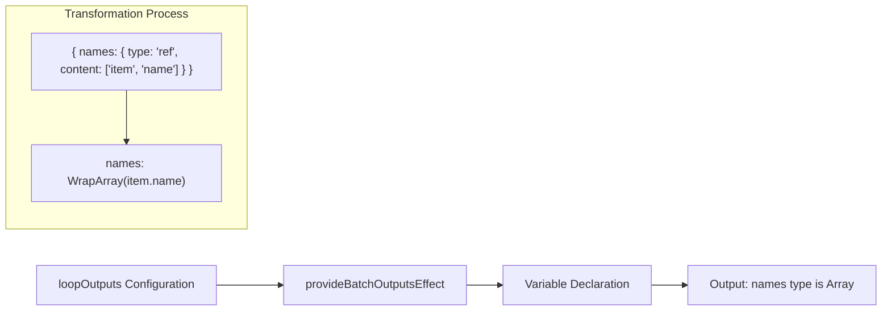

import { SourceCode } from '@theme';
import { BasicStory, WithInferSchemaStory } from 'components/form-materials/form-plugins/batch-outputs-plugin';

# batchOutputsPlugin

`batchOutputsPlugin` is a form plugin for loop nodes that implements two core functions:

1. **Output Variable Generation**: Converts variable references collected within the loop body into array-type output variables
2. **Scope Chain Transformation**: Adjusts the variable scope chain so that the loop node's outputs can correctly depend on child node outputs

**Core Features:**

- 🔄 **Array Wrapping**: Automatically wraps variables referenced within the loop body as array-type outputs
- 🔗 **Scope Chain Adjustment**: Allows the loop node's output variables to correctly depend on child node outputs
- 📊 **Schema Inference**: Optional configuration to automatically infer the JSON Schema of output variables

:::tip{title="Use Cases"}

- **Loop Nodes**: Need to collect data in each iteration and aggregate into arrays
- **Batch Processing Nodes**: Need to summarize results from multiple subtasks
- **Any Container Node with Child Nodes**: Need to collect output variables from child nodes

:::

:::warning

`BatchOutputs` component must be used with `batchOutputsPlugin` to work properly. This is because:
1. The component handles UI interaction, collecting output key-value pairs configured by the user
2. The plugin is responsible for converting configurations into variable declarations and adjusting the scope chain

:::

:::info{title="Complete Solution Overview"}

Implementing a complete loop node requires the following three materials working together:

| Material | Type | Responsibility |
|------|------|------|
| [BatchVariableSelector](../components/batch-variable-selector) | Component | Select the array data source for the loop |
| [provideBatchInputEffect](../effects/provide-batch-input) | Effect | Generate `item` and `index` local variables |
| [BatchOutputs](../components/batch-outputs) + **batchOutputsPlugin** | Component + Plugin | Configure loop outputs and generate array-type variables |

:::

## Demo

### Basic Usage

:::tip

Click the Debug panel in the upper right corner of the demo to view the generated output variables and JSON data sent to the backend

:::

<BasicStory />

```tsx pure title="form-meta.tsx"
import { FormRenderProps, FlowNodeJSON, Field, FormMeta } from '@flowgram.ai/free-layout-editor';
import {
  BatchOutputs,
  BatchVariableSelector,
  createBatchOutputsFormPlugin,
  IFlowRefValue,
  provideBatchInputEffect,
} from '@flowgram.ai/form-materials';

interface LoopNodeJSON extends FlowNodeJSON {
  data: {
    loopFor: IFlowRefValue;
  };
}

export const LoopFormRender = ({ form }: FormRenderProps<LoopNodeJSON>) => {
  return (
    <>
      <FormHeader />
      <FormContent>
        <Field<IFlowRefValue> name="loopFor">
          {({ field, fieldState }) => (
            <FormItem name="loopFor" type="array" required>
              <BatchVariableSelector
                style={{ width: '100%' }}
                value={field.value?.content}
                onChange={(val) => field.onChange({ type: 'ref', content: val })}
                hasError={Object.keys(fieldState?.errors || {}).length > 0}
              />
            </FormItem>
          )}
        </Field>
        <Field<Record<string, IFlowRefValue | undefined> | undefined> name="loopOutputs">
          {({ field, fieldState }) => (
            <FormItem name="loopOutputs" type="object" vertical>
              <BatchOutputs
                style={{ width: '100%' }}
                value={field.value}
                onChange={(val) => field.onChange(val)}
                hasError={Object.keys(fieldState?.errors || {}).length > 0}
              />
            </FormItem>
          )}
        </Field>
      </FormContent>
    </>
  );
};

export const formMeta: FormMeta = {
  render: LoopFormRender,
  effect: {
    loopFor: provideBatchInputEffect,
  },
  plugins: [createBatchOutputsFormPlugin({ outputKey: 'loopOutputs', inferTargetKey: 'outputs' })],
};
```

:::info{title="About FormHeader, FormContent, FormItem"}

The `FormHeader`, `FormContent`, and `FormItem` in the code above are user-defined layout components for unified form styling. You can implement them according to your project needs or replace them with other UI components.

:::

### With Schema Inference

<WithInferSchemaStory />

When the `inferTargetKey` parameter is configured, the plugin will automatically infer the JSON Schema of output variables when the form is submitted and store it in the specified field.

## API Reference

### createBatchOutputsFormPlugin

Factory function to create the batch outputs plugin.

```typescript
function createBatchOutputsFormPlugin(options: {
  outputKey: string;
  inferTargetKey?: string;
}): FormPlugin;
```

| Property | Type | Default | Description |
|--------|------|--------|------|
| `outputKey` | `string` | - | The field path in the form where loop output configurations are stored |
| `inferTargetKey` | `string` | - | Optional, the field path where the inferred JSON Schema will be stored |

### provideBatchOutputsEffect

Output variable generation effect that converts `Record<string, IFlowRefValue>` format configurations into array-type variable declarations.

```typescript
import { provideBatchOutputsEffect } from '@flowgram.ai/form-materials';

const formMeta: FormMeta = {
  effect: {
    loopOutputs: provideBatchOutputsEffect,
  },
};
```

:::tip

Typically, using `createBatchOutputsFormPlugin` is sufficient as it already includes `provideBatchOutputsEffect` internally. Only use this effect directly when you need the variable generation functionality without scope chain transformation.

:::

## Source Code Guide

<SourceCode
  href="https://github.com/bytedance/flowgram.ai/tree/main/packages/materials/form-materials/src/form-plugins/batch-outputs-plugin/index.ts"
/>

Use the CLI command to copy the source code locally:

```bash
npx @flowgram.ai/cli@latest materials form-plugins/batch-outputs-plugin
```

### Directory Structure

```
batch-outputs-plugin/
└── index.ts           # Complete plugin implementation, includes variable generation and scope chain transformation logic
```

### Core Implementation

#### Plugin Structure

`createBatchOutputsFormPlugin` is created using `defineFormPluginCreator` and contains two core lifecycles:

1. **onSetupFormMeta**: Configures form metadata, registers effects and submit formatting
2. **onInit**: Registers scope chain transformer during initialization

#### Output Variable Generation

`provideBatchOutputsEffect` converts `Record<string, IFlowRefValue>` into variable declarations:



Key point: Uses `ASTFactory.createWrapArrayExpression` to wrap single value types as array types.

#### Scope Chain Transformation

This is the most core functionality of this plugin, solving the variable scope problem for loop nodes.

:::info{title="Why is scope chain transformation needed?"}

In the default scope chain logic (refer to [Scope Chain Concept](../../guide/variable/concept#scope-chain)):
- Child node output variables **cannot** be accessed by downstream nodes of the parent node
- Loop node output variables **cannot** depend on child node outputs

However, in loop scenarios, we need:
- The loop node's outputs (such as aggregated arrays) to depend on values produced by child nodes in each iteration
- Child node variables to "cover" to the parent loop node's scope

:::

The following diagram illustrates how scope chain transformation works:

```mermaid
graph TB
    subgraph Default Scope Chain
        direction TB
        A1[Upstream Node.scope] --> B1[Loop Node.scope]
        B1 --> C1[Downstream Node.scope]
        B1 --> D1[Child Node.scope]
        D1 -.❌ Not Accessible.-> C1
    end

    subgraph Transformed Scope Chain
        direction TB
        A2[Upstream Node.scope] --> B2[Loop Node.scope]
        B2 --> C2[Downstream Node.scope]
        B2 --> D2[Child Node.scope]
        D2 -.✅ Can Cover.-> B2
        B2 -.Depends On.-> D2
    end
```



Two core methods of the transformer:

| Method | Purpose | Description |
|------|------|------|
| `transformCovers` | Extend cover scopes | Allows child node variables to "cover" to the parent loop node |
| `transformDeps` | Adjust dependency scopes | Allows the loop node's public scope to depend on its child nodes' scopes |

```mermaid
sequenceDiagram
    participant Loop as Loop Node
    participant Child as Child Node
    participant Transform as ScopeChainTransformService

    Note over Loop,Child: Problem: Loop node output depends on child node output

    Loop->>Transform: Register transformer

    Note over Transform: transformCovers (Cover Relationship)
    Child->>Transform: Child node queries cover scopes
    Transform-->>Child: Return [Parent Loop Node Scope]
    Note over Child: Child node variables can cover parent loop node

    Note over Transform: transformDeps (Dependency Relationship)
    Loop->>Transform: Loop node queries dependency scopes
    Transform-->>Loop: Return [Private Scope, ...Child Node Scopes]
    Note over Loop: Loop node output depends on child node output
```

#### Key Code Analysis

**1. Variable Generation Logic**

```typescript
export const provideBatchOutputsEffect: EffectOptions[] = createEffectFromVariableProvider({
  parse: (value: Record<string, IFlowRefValue>, ctx) => [
    ASTFactory.createVariableDeclaration({
      key: `${ctx.node.id}`,
      type: ASTFactory.createObject({
        properties: Object.entries(value).map(([_key, value]) =>
          ASTFactory.createProperty({
            key: _key,
            initializer: ASTFactory.createWrapArrayExpression({
              wrapFor: ASTFactory.createKeyPathExpression({
                keyPath: value?.content || [],
              }),
            }),
          })
        ),
      }),
    }),
  ],
});
```

**2. Scope Chain Transformer**

```typescript
chainTransformService.registerTransformer(transformerId, {
  transformCovers: (covers, ctx) => {
    const node = ctx.scope.meta?.node;
    if (node?.parent?.flowNodeType === batchNodeType) {
      return [...covers, getNodeScope(node.parent)];
    }
    return covers;
  },
  transformDeps(scopes, ctx) {
    const scopeMeta = ctx.scope.meta;
    if (scopeMeta?.type === FlowNodeScopeType.private) {
      return scopes;
    }
    const node = scopeMeta?.node;
    if (node?.flowNodeType === batchNodeType) {
      const childBlocks = node.blocks;
      return [
        getNodePrivateScope(node),
        ...childBlocks.map((_childBlock) => getNodeScope(_childBlock)),
      ];
    }
    return scopes;
  },
});
```

**3. Schema Inference (Optional)**

```typescript
if (inferTargetKey) {
  addFormatOnSubmit((formData, ctx) => {
    const outputVariable = getNodeScope(ctx.node).output.variables?.[0];
    if (outputVariable?.type) {
      set(formData, inferTargetKey, JsonSchemaUtils.astToSchema(outputVariable?.type));
    }
    return formData;
  });
}
```

### Dependencies

#### flowgram API

[**@flowgram.ai/editor**](https://github.com/bytedance/flowgram.ai/tree/main/packages/client/editor)
- `defineFormPluginCreator`: Factory function to define form plugins
- `EffectOptions`: Form effect options type
- `createEffectFromVariableProvider`: Create form effects from variable providers
- `FlowNodeRegistry`: Node registry type definition
- `FlowNodeScopeType`: Node scope type enum
- `getNodeScope`: Get the node's public scope
- `getNodePrivateScope`: Get the node's private scope
- `ScopeChainTransformService`: Scope chain transform service

[**@flowgram.ai/variable-core**](https://github.com/bytedance/flowgram.ai/tree/main/packages/variable-engine/variable-core)
- `ASTFactory`: AST creation factory
- `ASTFactory.createWrapArrayExpression`: Create array wrapping expression

[**@flowgram.ai/json-schema**](https://github.com/bytedance/flowgram.ai/tree/main/packages/variable-engine/json-schema)
- `JsonSchemaUtils.astToSchema`: Convert AST to JSON Schema

#### Dependent Materials

[**BatchOutputs**](../components/batch-outputs)
- Loop output configuration component for collecting output key-value pairs

[**BatchVariableSelector**](../components/batch-variable-selector)
- Array variable selector for selecting loop input

[**provideBatchInputEffect**](../effects/provide-batch-input)
- Loop input effect that generates item and index local variables

## FAQ

### Why do I need to use both BatchOutputs component and batchOutputsPlugin?

This is a separation of concerns design:

| Role | Responsibility |
|------|------|
| `BatchOutputs` Component | Provides UI interaction, lets users configure output key names and variable references |
| `batchOutputsPlugin` | Handles data logic, converts configurations to variable declarations and adjusts scope chain |

Using the component alone only collects data and cannot generate valid output variables; using the plugin alone has no UI to configure data.

### When do I need to configure inferTargetKey?

When you need to persist the output variable type information to form data (e.g., the backend needs to know the output JSON Schema), configuring `inferTargetKey` will automatically infer and store the Schema when the form is submitted.

### How to use it with provideBatchInputEffect?

A complete loop node is typically configured like this:

```typescript
export const formMeta: FormMeta = {
  render: LoopFormRender,
  effect: {
    loopFor: provideBatchInputEffect,
  },
  plugins: [
    createBatchOutputsFormPlugin({
      outputKey: 'loopOutputs',
      inferTargetKey: 'outputs'
    })
  ],
};
```

- `provideBatchInputEffect` is responsible for generating `item` and `index` local variables from the loop input array
- `batchOutputsPlugin` is responsible for aggregating variables collected within the loop body into array outputs

### Will scope chain transformation affect other nodes?

No. The transformer precisely matches the current node type through `batchNodeType` and only applies to that node type. The transformer ID also includes the node type to prevent duplicate registration.

## Related Materials

- [provideBatchInputEffect](../effects/provide-batch-input): Loop input variable parsing
- [BatchOutputs](../components/batch-outputs): Loop output configuration component
- [BatchVariableSelector](../components/batch-variable-selector): Array variable selector
- [inferInputsPlugin](./infer-inputs-plugin): Input parameter Schema inference plugin
